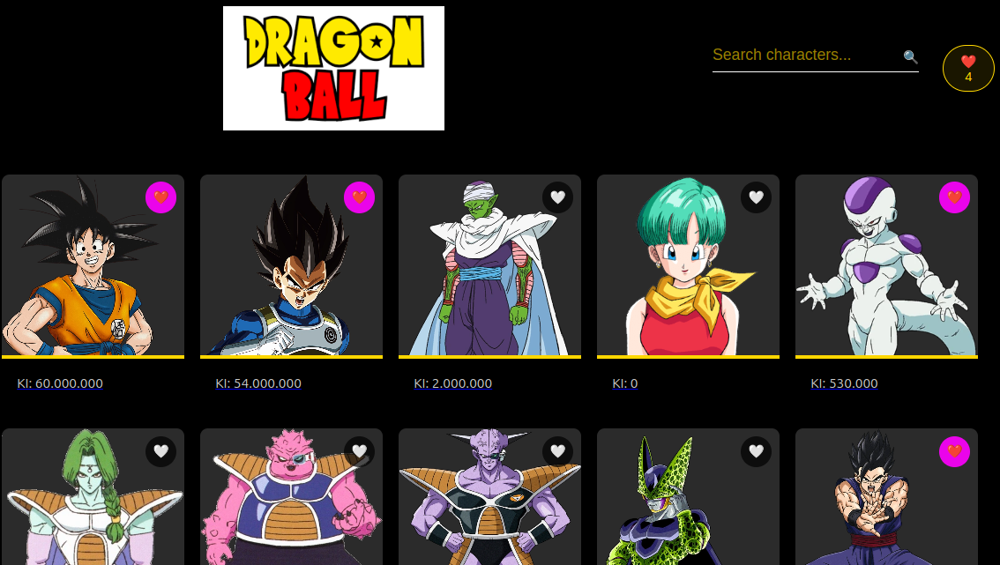

# Dragon Ball Zara



Una aplicación React que muestra personajes de Dragon Ball con diseño responsivo, sistema de favoritos y almacenamiento en caché de la API.

## Arquitectura

### Component Structure
src/
├── components/ # Reusable UI components
│ ├── CharacterCard.tsx
│ ├── ErrorBoundary.tsx
│ └── ...
├── views/
│ ├── MainView.tsx
│ └── DetailView.tsx
└── contexts/ # Application state


### Arquitectura en Capas
| Layer          | Tech                 | Descripción                               |
|----------------|----------------------|-------------------------------------------|
| **UI**         | React 19 + TSX       | Basada en componentes con Framer Motion   |
| **State**      | Context API          | Gestión de favoritos                      |
| **Services**   | Axios + Cache        | Llamadas a la API con Cache (24h TTL)     |
| **Styling**    | SCSS Modules         | Propiedades lógicas + Responsivo          |
| **Build**      | Vite 4               | Desarrollo ultrarrápido                   |

## Características Principales

### User Experience
- **Responsive Grid Layout**
  - 5 tarjetas en escritorio | 2 en móvil
  - CSS Grid con gestión de puntos de ruptura
- **Visor de personajes**
  - Perfiles detallados de personajes
  - Galerías de transformaciones
  - Apariciones en cómics

### Performance
- **API Caching**
  - 24-hour TTL para todas las solicitudes
  - Solicitudes concurrentes deduplicadas
- **Optimized Assets**
  - Lazy-loaded images
  - División de código mediante Vite

### Mobile-First
- **Touch-friendly UI**
  - 48px touch targets
  - Smooth transitions
- **Diseño adaptable**
  - 393px mobile viewport support
  - Tipografía flexible con `clamp()`

## Tech Stack

### Core
- React 19 (con Hooks API)
- TypeScript 5
- Vite 4

### State Management
- Context API
- localStorage persistence

### Styling
- SCSS Modules
- Framer Motion animations

### API Layer
- Axios con cache interceptor
- Dragon Ball API integration

## 🚀 Primeros Pasos

### Requisitos Previos
- Node.js 18+

### Instalación
```bash
git clone 
cd dragonball-zara
npm install
Configuration
Create .env file:

env
VITE_API_KEY=https://dragonball-api.com/api

Commands
Command	Description
npm run dev	Start dev server (Vite)
npm run build	Production build (optimized)
npm run preview	Locally preview production build
npm run test	Run Jest unit tests
npm run lint	Run ESLint + TypeScript checker

API service mocks

Context providers

Error boundaries

bash
npm test -- --coverage
Deployment
Vercel
Push to GitHub/GitLab

Import project in Vercel

Set environment variables

Deploy!

Project Structure
.
├── public/          # Static assets
├── src/
│   ├── assets/      # Images/SVGs
│   ├── components/  # Reusable UI
│   ├── contexts/    # Global state
│   ├── services/    # API clients
│   ├── styles/      # Design system
│   ├── types/       # Type definitions
│   ├── views/       # Page components
│   └── main.tsx     # App entry
├── vite.config.ts   # Build config
└── tsconfig.json    # TypeScript setup

Documentation
API Reference
Dragon Ball API Docs

Design Tokens
See src/styles/variables.scss for:

Color palette

Breakpoints

📜 License
MIT © Luiz Araujo 2025

Key improvements:
Jerarquía visual añadida con emojis y secciones
Desglose detallado de la pila tecnológica
Instrucciones de despliegue incluidas
Documentación mejorada de la estructura del proyecto
Guías de pruebas y contribución añadidas
Mejor documentación de comandos
Resumen de características específicas para móviles
Referencia a la documentación de la API
Mejoras en accesibilidad
